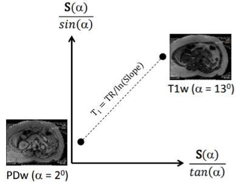

# **T1 and PD mapping using Variable Flip Angle (VFA)**
## **Also known as Driven Equilibrium Single Pulse Observation of T1 (DESPOT1)**

### **1. Data**
-   Spoiled gradient-echo (SPGR) data
    * 2 images: variable excitation angles (α)
    * Fixed repetition time (TR)
    * Fixed echo time (TE)

### **2. Inputs**
-   Signal Sn(αn), for each flip angle αn (*n=1,2*).
-   Repetition time TR

### **3. Method**
Assuming a longitudinal steady-state has been reached with perfect spoiling, the signal Sz (for a given voxel *z*) of a SPGR sequence is:

​

 

Which can rearranged to fit a linear form:

 

If we plot
 against :  

 
Fig. 1 - An example showing linearisation from two acquired signals  

Now it is clear that *ε* is equal to the line gradient *b*, from which we can gain the value of T1. And, the intercept *c*, from which we can gain the value of M0 (Proton Density - PD). The gradient can be calculated as follows:

 

After which, the intercept can be calculated via substitution of one of the signal points:

 

We are then able to gain our T1 mapping and M0 as:

### **4. References**

1.  Deoni, S. C. L., Williams, S. C. R., Jezzard, P., Suckling, J.,
    Murphy, D. G. M., & Jones, D. K. (2008). Standardized structural
    magnetic resonance imaging in multicentre studies using quantitative
    T1 and T2 imaging at 1.5 T. NeuroImage, 40(2), 662--671.
    <https://doi.org/10.1016/j.neuroimage.2007.11.052>

2.  Helms, G., Dathe, H., & Dechent, P. (2008). Quantitative FLASH MRI
    at 3T using a rational approximation of the Ernst equation. Magnetic
    Resonance in Medicine, 59(3), 667--672.
    https://doi.org/10.1002/mrm.21542

3.  Lee, Y., Callaghan, M. F., & Nagy, Z. (2017). Analysis of the
    precision of variable flip angle T1mapping with emphasis on the
    noise propagated from RF transmit field maps. Frontiers in
    Neuroscience, 11(MAR). <https://doi.org/10.3389/fnins.2017.00106>

4.  Maier, O. (2016). T 1 -mapping from variable flip angle data
    utilizing constrained model-based reconstruction.
